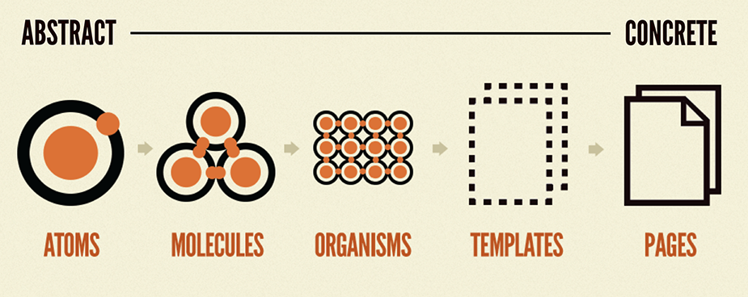

# Atomic Design



## I. Overview
-  Atomic design is not a linear process
### 1. Atoms
```sh
- These atoms include basic elements like form "labels", "inputs", "buttons", and others that can’t be broken down any further without ceasing to be functional.
```

### 2. Molecules
```sh
-  Molecules are groups of atoms bonded together that take on distinct new properties.

- Molecules are relatively simple groups of UI elements functioning together as a unit. For example, a "form label", "search input", and button can join together to create a search form molecule.
```

### 3. Organisms
```sh
-  Organisms are relatively complex UI components composed of groups of molecules and/or atoms and/or other organisms.

- Organisms can consist of similar or different molecule types. A header organism might consist of dissimilar elements such as a logo image, primary navigation list, and search form.
```

### 4. Templates
```sh
-  Templates are page-level objects that place components into a layout and articulate the design’s underlying content structure.
```

### 5. Pages
```sh
-  Pages are specific instances of templates that show what a UI looks like with real representative content in place.
```

## II. Advantages
- One of the biggest advantages atomic design provides is the ability to quickly shift between abstract and concrete
- Clean separation between structure and content

## III. Preferences
(https://atomicdesign.bradfrost.com/chapter-2/)