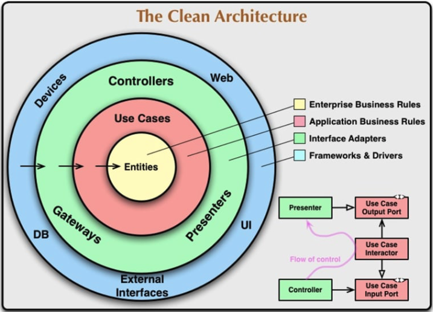

# Clean Architecture
- It’s all about Dependency Rule! The inner circle is not allowed to know anything about the outer circle.



## I. About Dependency Rule
- The concentric circles represent different areas of software
- Nothing in an inner circle can know anything at all about something in an outer circle
-  In particular, the name of something declared in an outer circle must not be mentioned by the code in the an inner circle. That includes, functions, classes. variables, or any other named software entity.

## II. Overview
-  Clean architecture aims to divide a big project into pieces (classes, entities, modules etc.), make them independent from each other : our big and complex project become more maintainable, flexible and easy to work on together.
- 4 main points about Clean Architecture :
  + Independent of Frameworks. The architecture does not depend on the existence of some library of feature laden software. This allows you to use such frameworks as tools, rather than having to cram your system into their limited constraints.
  + Testable. The business rules can be tested without the UI, Database, Web Server, or any other external element.
  + Independent of UI. The UI can change easily, without changing the rest of the system. A Web UI could be replaced with a console UI, for example, without changing the business rules.
  + Independent of Database. You can swap out Oracle or SQL Server, for Mongo, BigTable, CouchDB, or something else. Your business rules are not bound to the database.
  + Independent of any external agency. In fact your business rules simply don’t know anything at all about the outside world.
- There are 4 main layers : Entities, Use Cases, Adapters and Infrastructure.

### 1. Entities
```sh
- Entities are a set of business rules that are critical to the application. 
- This layer knows nothing about the other layers, which means entities don’t depend on anywhere or anything.
```

### 2. Use Cases
```sh
- Entities are a set of business rules that are critical to the application. 
- This layer knows nothing about the other layers, which means entities don’t depend on anywhere or anything.
```

### 3. Adapters
```sh
- Adapter layer is literally an adapter between domain and infrastructure.
```

### 4. Infrastructure
```sh
- This layer is so likely to change so it is as far as possible from the other stable domain layers.
```

## III. Preferences
(https://celepbeyza.medium.com/introduction-to-clean-architecture-acf25ffe0310)

(https://blog.cleancoder.com/uncle-bob/2012/08/13/the-clean-architecture.html)