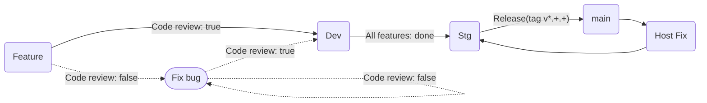
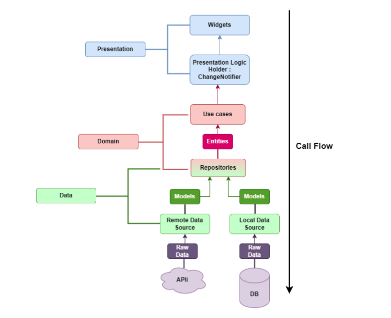

# Base Architecture

## 1. Overview
### Branch Rules
```sh
- main      # main branch
- stg       # stg branch
- dev       # dev branch
- config/*   # code config sources
- feature/* # code feature
- fix/*     # code bug
```

### Flow


### Makefile
[(Makefile)](/Makefile)
```sh
- use "make" to run command
Ex: "make pub" --> "fvm flutter pub get"
- Read Makefile to get more information
```

### Directory Structure
- This source use the clean architecture


- Data Flow



- If you update this source structure, you need to change this directory tree
```sh
- use "brew" to install tree
- use "tree" to get the directory tree
Ex: "cd lib/" --> "tree" --> the directory tree is shown in the terminal window
- copy and paste here
```
```yml
-> lib
    |-> common
    |   |-> gen
    |   |   '-> assets.gen.dart
    |   |   '-> colors.gen.dart
    |-> domain
    |   |-> data
    |   |   |-> local_data_source
    |   |   |   '-> local.dart
    |   |   |-> remote_data_source
    |   |   |   '-> remote.dart
    |   |   |-> model
    |   |   |   |-> model
    |   |   |   |   '-> model.dart
    |   |   |   |-> request
    |   |   |   |   '-> request.dart
    |   |   |   |-> response
    |   |   |   |   '-> response.dart
    |   |   |   '-> model.dart
    |   |   '-> data.dart
    |   |-> repository
    |   |   '-> repository.dart
    |   |-> services
    |   |   |-> di
    |   |   |   '-> service_locator.dart
    |   |   |-> locals
    |   |   |   |-> share_preference
    |   |   |   |   '-> share_preference_service.dart
    |   |   |   |-> sqlite
    |   |   |   |   '-> sqlite.dart
    |   |   |   '-> locals.dart
    |   |   |-> networks
    |   |   |   '-> api_client.dart
    |   |   |   '-> network.dart
    |   |   '-> services.dart
    |   |-> usecase
    |   |   '-> usecase.dart
    |   '-> domain.dart
    |-> presentation
    |   |-> common
    |   |   |-> atomic
    |   |   |   |-> atoms
    |   |   |   |   '-> atoms.dart
    |   |   |   |-> molecules
    |   |   |   |   '-> molecules.dart
    |   |   |   |-> organisms
    |   |   |   |   '-> organism.dart
    |   |   |   |-> templates
    |   |   |   |   '-> template.dart
    |   |   |   '-> atomic.dart
    |   |   |-> base
    |   |   |   |-> app_bar
    |   |   |   |   '-> base_app_bar.dart
    |   |   |   |-> scaffold
    |   |   |   |   '-> base_scaffold.dart
    |   |   |   '-> base.dart
    |   |   '-> common.dart
    |   |-> pages
    |   |   |-> name
    |   |   |   |-> widget
    |   |   |   |   '-> name_widget.dart
    |   |   |   |-> bloc/controller/provider/riverpod
    |   |   |   '-> name_screen.dart
    |   |-> routers
    |   |   '-> router_path.dart
    |   |   '-> router.dart
    |   |   '-> router.gr.dart
    |   |-> services
    |   |   |-> di
    |   |   |-> firebase
    |   |-> shared
    |   |   |-> constant
    |   |   |   '-> app_constant.dart
    |   |   |-> flavor
    |   |   |   '-> app_flavor.dart
    |-> shared
    |   |-> constant
    |   |   '-> app_constant.dart
    |   |-> flavor
    |   |   '-> app_flavor.dart
    |-> utils
    |   |-> extensions
    |   |   '-> theme_ext.dart
    |   |   '-> widget_ext.dart
    |   |   '-> extensions.dart
    |   |-> helpers
    |   |   '-> helper.dart
    |   |-> theme
    |   |   '-> themes.dart
    |   '-> utils.dart
    '-> main_config.dart
    '-> main.dart
```

## 2. Getting Started
### Install
#### fvm
```sh
- fvm install 3.22.3
- fvm use 3.22.3
```
#### run
```sh
- make setup
- make run
```
